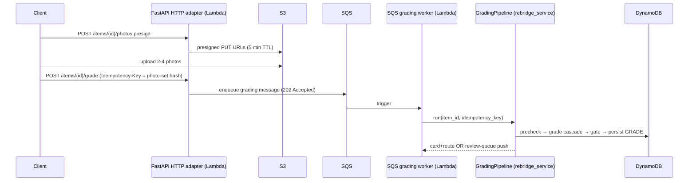
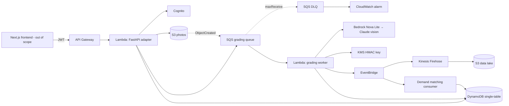

# Design Document

## Overview

ReBridge_Backend is the v1 (48-hour build) backend for an AI grading, smart routing, and Product Health Card engine for returned and pre-owned items. It exposes a FastAPI service on AWS Lambda for synchronous request/response operations and an SQS-triggered grading worker Lambda for the asynchronous grading pipeline. Both share one business-logic core.

This design realizes the requirements in `requirements.md` through a **three-layer architecture organized as three separate, independently-installable Python packages inside a single repository (a monorepo with per-layer packages)**:

- `rebridge_data` — Data layer. Repositories and gateways wrapping all infrastructure (DynamoDB single-table, S3 presigned URLs, SQS, KMS HMAC signing, EventBridge). Exposes abstract interfaces. `boto3` lives **only** here. No business logic, no HTTP.
- `rebridge_service` — Service / business-logic layer. The defensible core: grading pipeline orchestration, quality precheck, confidence gating, routing policy with agent + pure-function fallback, Health Card render/sign/verify, demand matching, eventing logic. Depends **only** on `rebridge_data` interfaces.
- `rebridge_api` — API / presentation layer. FastAPI routers, the Lambda HTTP adapter, the SQS-triggered grading worker entrypoint, Pydantic models, Cognito JWT auth, and the dependency-injection composition root. Depends on `rebridge_service`.

The dependency direction is strictly one-way: **`api → service → data`**. The service layer never imports `boto3` or any concrete AWS client; it is programmed entirely against interfaces injected through constructors. This makes the grading-provider seam (Requirement 8.4) and the agent/pure-function routing equivalence (Requirement 10.8) first-class architectural features rather than afterthoughts, and lets the three packages later be split into true separate repositories with minimal change.

### Design Goals Traceability

| Goal | Requirements |
|------|-------------|
| Full grading → Health Card → routing core | 1, 4, 5, 6, 8, 10, 11, 12, 18.1 |
| Async, idempotent, reliable pipeline | 7, 9 |
| Provider-swappable grading | 8.4 |
| Agent / pure-function decision equivalence | 10.8 |
| Tamper-evident, publicly verifiable cards | 11, 12 |
| Seeded demand matching | 13, 18.2 |
| Human review console | 14 |
| Lifecycle eventing | 15 |
| Security and data minimization | 16, 17 |
| Scope discipline | 18 |

## Architecture

### Layered Package Structure

```mermaid
graph TD
    subgraph API["rebridge_api  (presentation layer)"]
        HTTP["FastAPI routers + Lambda HTTP adapter"]
        WORKER["SQS grading worker entrypoint"]
        AUTH["Cognito JWT dependency"]
        ROOT["composition root (DI wiring)"]
        PYD["Pydantic request/response models"]
    end

    subgraph SVC["rebridge_service  (business logic layer)"]
        ITEMSVC["ItemService"]
        PIPE["GradingPipeline"]
        PRECHK["QualityPrecheck"]
        GATE["ConfidenceGate"]
        ROUTER["RoutingAgent (+ pure-function fallback)"]
        CARD["HealthCardService"]
        DEMAND["DemandMatchingEngine"]
        REVIEW["ReviewConsoleService"]
        EVT["EventingService"]
    end

    subgraph DATA["rebridge_data  (data layer, boto3 only here)"]
        IREPO["ItemRepository (iface)"]
        REVQ["ReviewQueueRepository (iface)"]
        OBJ["ObjectStore / S3 (iface)"]
        QUEUE["QueueClient / SQS (iface)"]
        SIGNER["CardSigner / KMS (iface)"]
        PUB["EventPublisher / EventBridge (iface)"]
        PROV["GradingProvider (iface)"]
        BUYERS["BuyerPersonaRepository (iface)"]
    end

    HTTP --> ROOT
    WORKER --> ROOT
    ROOT --> ITEMSVC & PIPE & ROUTER & CARD & DEMAND & REVIEW & EVT
    ITEMSVC --> IREPO & OBJ
    PIPE --> PRECHK & GATE & PROV & IREPO & OBJ & QUEUE & REVQ
    ROUTER --> IREPO
    CARD --> SIGNER & IREPO
    DEMAND --> BUYERS & IREPO & PUB
    REVIEW --> REVQ & IREPO
    EVT --> PUB
```



The service layer depends on the abstract interfaces (right column) defined in `rebridge_data`; the composition root in `rebridge_api` is the only place where concrete boto3-backed implementations are constructed and injected.

### Dual Entry Adapters

Both adapters live in `rebridge_api` and call the **same** `rebridge_service` classes with the **same** injected data-layer implementations. The synchronous API accepts grading submissions and enqueues them; the worker consumes the queue and runs the pipeline.



Stage 0 (the 48h demo) MAY run the pipeline synchronously inside the HTTP request for convenience, but `GradingPipeline` is invoked through the identical interface in both paths, so flipping sync→async requires no business-logic change (Requirement 7.1, 9.1).

### AWS Topology



OpenSearch, ElastiCache, and Kinesis Firehose analytics are Stage 2+ infrastructure; their seams exist in v1 (the `EventPublisher` interface, the marketplace query repository) but are backed by DynamoDB GSIs and direct invocation in Stage 0.

### Staged Scaling Story (1 → 100 → 1,000 → 1,000,000)

| Stage | Scale | What runs | What changes from prior stage |
|-------|-------|-----------|-------------------------------|
| 0 | 1 (48h demo) | Sync or single-queue grading, single Bedrock model, DynamoDB single-table, seeded buyers | — |
| 1 | ~100 items | SQS async worker enabled, model cascade (Nova Lite → Claude) active, DLQ + alarm | Flip pipeline invocation from sync to SQS-triggered; **no business-logic change** because both adapters call the same `GradingPipeline` |
| 2 | ~1,000 | OpenSearch for marketplace/geo search, ElastiCache for price-band and demand-index caching, EventBridge → Firehose → S3 lake | Swap `MarketplaceRepository` and `DemandProbe` implementations behind their interfaces |
| 3 | ~1,000,000 | Trained CNN grading model swapped behind `GradingProvider`, sharded queues, read replicas / RDS for relational analytics | Swap `GradingProvider` implementation; partition queue; **service layer untouched** |

The seams that make these swaps cheap are designed into v1: the `GradingProvider` interface (8.4), idempotency keys (7.2), event emission (15), and an async-capable pipeline interface (7.1).

## Components and Interfaces

### Data Layer (`rebridge_data`) — Interfaces

All interfaces are abstract base classes (or `typing.Protocol`). Concrete boto3-backed implementations (`Dynamo*`, `S3*`, `Sqs*`, `Kms*`, `EventBridge*`, `Bedrock*`) live in the same package but are only referenced by the composition root.

```python
class ItemRepository(ABC):
    def put_item_meta(self, item: ItemMeta) -> None: ...
    def get_item(self, item_id: str) -> ItemAggregate | None: ...   # META + all facets
    def update_status(self, item_id: str, status: ItemStatus) -> None: ...
    def put_grade(self, item_id: str, grade: GradeRecord) -> None: ...
    def get_grade(self, item_id: str) -> GradeRecord | None: ...
    def put_card(self, item_id: str, card: CardRecord) -> None: ...
    def get_card(self, card_id: str) -> CardRecord | None: ...
    def put_decision(self, item_id: str, decision: DecisionRecord) -> None: ...
    def put_listing(self, item_id: str, listing: ListingRecord) -> None: ...
    def update_listing(self, item_id: str, patch: ListingPatch) -> ListingRecord: ...
    def get_listing(self, item_id: str) -> ListingRecord | None: ...
    def delete_listing(self, item_id: str) -> None: ...
    def query_marketplace(self, category: str, geo: str | None, ...) -> list[ListingRecord]: ...
    # Idempotent conditional write used by the gate; returns False if grade already present
    def put_grade_if_absent(self, item_id: str, idem_key: str, grade: GradeRecord) -> bool: ...

class ReviewQueueRepository(ABC):
    def enqueue(self, entry: ReviewQueueEntry) -> None: ...                 # priority = value*(1-confidence)
    def list_pending(self, limit: int) -> list[ReviewQueueEntry]: ...       # ordered by priority desc
    def get(self, item_id: str) -> ReviewQueueEntry | None: ...
    def resolve(self, item_id: str) -> None: ...

class ObjectStore(ABC):
    def presign_put(self, key: str, ttl_seconds: int) -> PresignedUrl: ...  # ttl_seconds = 300
    def get_bytes(self, key: str) -> bytes: ...

class QueueClient(ABC):
    def send_grading_message(self, msg: GradingMessage) -> None: ...

class CardSigner(ABC):                       # KMS-managed HMAC key
    def sign(self, payload: bytes) -> str: ...
    def verify(self, payload: bytes, signature: str) -> bool: ...

class EventPublisher(ABC):
    def publish(self, event: LifecycleEvent) -> None: ...

class GradingProvider(ABC):                  # the swappable model seam (8.4)
    def grade(self, images: list[bytes], catalog: CatalogContext) -> RawModelResponse: ...
    @property
    def name(self) -> str: ...

class BuyerPersonaRepository(ABC):           # seeded data in v1 (13.6, 18.2)
    def candidates(self, geo: str, category: str) -> list[BuyerPersona]: ...
```

### Service Layer (`rebridge_service`) — Classes

Each class has a single responsibility and receives its collaborators (always interfaces) via its constructor. None import boto3.

- **`ItemService`** — item creation, retrieval/aggregation, presigned-URL request validation (2–4 photo rule), listing CRUD with grade-required guard. Collaborators: `ItemRepository`, `ObjectStore`, `EventingService`. Requirements 1, 2, 3, 15.3.

- **`QualityPrecheck`** — pure-ish OpenCV blur (variance-of-Laplacian) and exposure assessment per photo; returns pass/fail with the failing photo identified. Requirement 4.

- **`GradingEngine`** — wraps the `Model_Cascade`. Invokes the injected `GradingProvider` list in order (Nova Lite → Claude vision), enforces per-call timeout, parses strict JSON against the grade-assessment schema, retries invalid JSON up to 2×. Requirements 5, 8.

- **`ConfidenceGate`** — compares `Confidence_Score` against the configured `Confidence_Threshold` (default 0.80) and decides auto-continue vs review. Requirement 6.

- **`GradingPipeline`** — orchestrates the worker flow: idempotency check → fetch images → `QualityPrecheck` → catalog context → `GradingEngine` → parse → `ConfidenceGate` → persist GRADE → branch (make card + invoke router, or push to review queue with priority `est_value * (1 - confidence)`). Collaborators: all of the above plus `ItemRepository`, `ObjectStore`, `ReviewQueueRepository`, `HealthCardService`, `RoutingAgent`, `EventingService`. Requirements 4–9.

- **`RoutingAgent`** — computes value via `PriceEstimator`, cost via `CostModel`, demand index via `DemandProbe`; selects argmax-margin disposition among {RESELL, REFURB, P2P, DONATE} with margin > 0, else DONATE; tie-break toward faster customer outcome (P2P > RESELL). Persists DECISION with rationale showing the math. Has two interchangeable strategies behind one `RoutingStrategy` interface — `AgentRoutingStrategy` (LangGraph) and `PureFunctionRoutingStrategy` — that MUST produce identical output structure (10.8). Requirement 10.

- **`PriceEstimator`**, **`CostModel`**, **`DemandProbe`** — pure routing tools. Price band from a category/grade/age CSV table; costs per route; seeded neighborhood demand index. Requirements 10.1–10.3.

- **`HealthCardService`** — renders the card (grade, annotated photos, plain-language defect summary, verification date, warranty stance), signs the canonical payload `card_id | item_id | grade | graded_at` with HMAC-SHA256 via `CardSigner`, persists CARD with signature + QR target `/cards/{card_id}/verify?sig=`, and verifies by recompute-and-compare. Requirements 11, 12.

- **`DemandMatchingEngine`** — on `LISTED` event: candidates from `BuyerPersonaRepository` filtered by geo radius + category + wishlist/cart; scores `weighted(intent, lifecycle, geo, price_sensitivity)`; applies anti-cannibalization weighting favoring deal-seeker / price-balker personas; ranks desc; pushes top-N + upserts PDP shelf; emits `MATCHED`. Requirement 13.

- **`ReviewConsoleService`** — lists the review queue ordered by `value * uncertainty` desc; confirm sets status GRADED; override persists new grade, sets GRADED, stores training signal; rejects actions on items not pending review. Requirement 14.

- **`EventingService`** — emits GRADED, ROUTED, LISTED, MATCHED, SOLD through `EventPublisher`. Requirement 15.

### API Layer (`rebridge_api`)

- **FastAPI routers** map HTTP to service calls and own Pydantic request/response models and serialization.
- **Lambda HTTP adapter** (Mangum-style) hosts FastAPI on Lambda.
- **SQS grading worker entrypoint** parses the SQS record and calls `GradingPipeline.run(...)`.
- **Cognito JWT dependency** guards private routes; the public verify route omits it (16, 12.4).
- **Composition root** (`wiring.py`) constructs concrete data-layer implementations once and injects them into service classes. Configuration (confidence threshold, timeouts, top-N, table name, KMS key id) is read here.

```python
# rebridge_api/wiring.py  (composition root — the only place concretes are built)
def build_container(cfg: Config) -> Container:
    item_repo   = DynamoItemRepository(cfg.table_name)
    review_repo = DynamoReviewQueueRepository(cfg.table_name)
    store       = S3ObjectStore(cfg.bucket)
    queue       = SqsQueueClient(cfg.queue_url)
    signer      = KmsCardSigner(cfg.kms_key_id)
    publisher   = EventBridgePublisher(cfg.event_bus)
    buyers      = SeededBuyerPersonaRepository()
    providers   = [BedrockNovaLiteProvider(cfg), ClaudeVisionProvider(cfg)]  # cascade order

    grading_engine = GradingEngine(providers, timeout=cfg.model_timeout, max_json_retries=2)
    gate           = ConfidenceGate(threshold=cfg.confidence_threshold)      # default 0.80
    routing        = RoutingAgent(strategy=select_strategy(cfg), price=PriceEstimator(cfg.price_csv),
                                  cost=CostModel(cfg), demand=DemandProbe(buyers))
    card_svc       = HealthCardService(signer, item_repo)
    eventing       = EventingService(publisher)
    pipeline       = GradingPipeline(item_repo, store, review_repo, QualityPrecheck(cfg),
                                     grading_engine, gate, card_svc, routing, eventing)
    # ... ItemService, DemandMatchingEngine, ReviewConsoleService wired similarly
    return Container(...)
```

### API Contracts

| Method | Path | Auth | Description | Requirements |
|--------|------|------|-------------|-------------|
| POST | `/items` | JWT | Create item (order-scan or manual context); status CREATED | 1.1, 1.2, 1.3 |
| POST | `/items/{id}/photos:presign` | JWT | 2–4 presigned PUT URLs, 5-min TTL | 2.1, 2.2, 2.4 |
| POST | `/items/{id}/grade` | JWT | Enqueue grading; **202** + `Idempotency-Key` header (photo-set hash) | 7.1, 7.2 |
| GET | `/items/{id}` | JWT | Item status + GRADE/CARD/DECISION/LISTING facets | 1.4, 1.5 |
| POST | `/items/{id}/route` | JWT | Run routing decision | 10 |
| POST | `/listings` / PUT/DELETE `/listings/{id}` | JWT | Listing CRUD (grade-required guard) | 3 |
| GET | `/marketplace?category&geo` | JWT | Query listings | 3, 13 |
| POST | `/listings/{id}/buy` | JWT | Simulated checkout v1; emits SOLD | 15.5, 18.4 |
| GET | `/cards/{card_id}/verify?sig=` | **none** | Public verify (verified/tampered) | 12.1–12.4, 16.3 |
| GET | `/review/queue` | JWT | Pending grades by value×uncertainty desc | 14.1 |
| POST | `/review/{id}` | JWT | Confirm/override | 14.2–14.4 |

## Data Models

### DynamoDB Single-Table Model

Partition key `PK`, sort key `SK`. Requirement 1.6, 17.

| Entity | PK | SK | Notable attributes |
|--------|----|----|--------------------|
| Item meta | `ITEM#<id>` | `META` | status, category, age, context_source, created_at |
| Grade | `ITEM#<id>` | `GRADE` | grade, defects[], completeness, confidence, summary, idem_key, confirmed |
| Card | `ITEM#<id>` | `CARD` | card_id, signature, qr_target, graded_at, warranty_stance |
| Decision | `ITEM#<id>` | `DECISION` | disposition, price, rationale, value, cost, margin |
| Listing | `ITEM#<id>` | `LISTING` | status, category, price, geohash5, listed_at |
| User profile | `USER#<id>` | `PROFILE` | persona attributes |
| Wishlist | `USER#<id>` | `WISH#<category>` | intent signals |

Global secondary indexes:

| Index | PK | SK | Purpose | Requirements |
|-------|----|----|---------|-------------|
| GSI1 marketplace | `LIST#<status>` | `<category>#<price>` | marketplace browse | 3.3, 13 |
| GSI2 geo | `GEO#<geohash5>` | `<category>#<listed_at>` | geo-radius candidate lookup | 13.1, 17 |
| GSI3 review queue | `REVIEW#PENDING` | `<value*uncertainty desc>` | prioritized review queue | 14.1 |

Location is stored only as `geohash5`; no finer precision is persisted anywhere (17.1, 17.2).

### Domain Models (service layer, framework-free dataclasses)

```python
class ItemStatus(Enum):
    CREATED; RETAKE_REQUIRED; GRADING; PENDING_REVIEW; GRADED; LISTED; SOLD

class Grade(Enum):
    LIKE_NEW; VERY_GOOD; GOOD; ACCEPTABLE; UNSELLABLE

@dataclass
class Defect: location: str; severity: str

@dataclass
class GradeAssessment:
    grade: Grade
    defects: list[Defect]
    completeness: CompletenessResult
    confidence: float          # 0.0..1.0 inclusive
    summary: str

@dataclass
class Disposition(Enum): RESELL; REFURB; P2P; DONATE

@dataclass
class RoutingDecision:
    disposition: Disposition
    price: Decimal
    value: Decimal; cost: Decimal; margin: Decimal
    rationale: str             # shows value, cost, margin math

@dataclass
class HealthCard:
    card_id: str; item_id: str; grade: Grade; graded_at: str
    defect_summary: str; warranty_stance: str
    annotated_photo_keys: list[str]; signature: str; qr_target: str
```

The grade-assessment JSON schema (used for strict parsing in 5.6) mirrors `GradeAssessment`. The HMAC signing payload is the canonical concatenation `card_id | item_id | grade | graded_at` (11.2, 12.1).

## Correctness Properties

*A property is a characteristic or behavior that should hold true across all valid executions of a system — essentially, a formal statement about what the system should do. Properties serve as the bridge between human-readable specifications and machine-verifiable correctness guarantees.*

These properties were derived from the prework analysis, with redundant criteria consolidated so each property provides unique validation value. They target the pure logic of the service layer, exercised against in-memory fakes of the data-layer interfaces.

### Property 1: Item creation invariant

*For any* valid item-creation request (order-scan or manual context), the created Item SHALL have a unique item identifier and an initial status of CREATED.

**Validates: Requirements 1.1, 1.2**

### Property 2: Missing required field is rejected with field identified

*For any* otherwise-valid creation request with exactly one required field removed, creation SHALL be rejected with a validation error naming the removed field.

**Validates: Requirements 1.3**

### Property 3: Item retrieval returns exactly the persisted facets

*For any* Item with an arbitrary subset of GRADE, CARD, DECISION, and LISTING facets persisted, retrieving the Item SHALL return its status and exactly those facets.

**Validates: Requirements 1.4**

### Property 4: Presigned URL count matches valid request and rejects out-of-range counts

*For any* requested photo-slot count n, the Item_API SHALL return n presigned URLs when 2 ≤ n ≤ 4, and SHALL reject with a 2-to-4 range error otherwise.

**Validates: Requirements 2.1, 2.4**

### Property 5: Listing round-trip and grade-required guard

*For any* graded Item and valid listing, create-then-get SHALL return an equal listing, update-then-get SHALL reflect the patch, and delete-then-get SHALL return none; *for any* Item without a grade, listing creation SHALL be rejected with a grade-required error.

**Validates: Requirements 3.1, 3.2, 3.3, 3.4, 3.5**

### Property 6: Quality precheck gates grading

*For any* submitted photo set, every photo SHALL be assessed for blur and lighting before the Grading_Engine is invoked; *for any* set containing at least one failing photo, the Item status SHALL become RETAKE_REQUIRED with the failing photo identified and the Grading_Engine SHALL NOT be invoked; *for any* all-passing set, the Grading_Engine SHALL be invoked.

**Validates: Requirements 4.1, 4.2, 4.3**

### Property 7: Grade-assessment schema invariant and parse round-trip

*For any* schema-conforming grade assessment, serializing then strictly parsing SHALL yield an equivalent assessment whose grade is one of the five allowed values, whose every defect has a location and severity, which includes a completeness result and a non-empty plain-language summary, and whose confidence lies in the closed interval [0, 1].

**Validates: Requirements 5.1, 5.2, 5.3, 5.4, 5.5, 5.6**

### Property 8: Non-conforming model response routes to review

*For any* model response that does not parse as schema-conforming JSON (after the allowed retries), the Grading_Pipeline SHALL set the Item to a review state.

**Validates: Requirements 5.7**

### Property 9: Confidence gate decision boundary

*For any* grade assessment, when its confidence is greater than or equal to the configured threshold the Grading_Pipeline SHALL persist the grade and continue to event emission, and when its confidence is below the threshold the Grading_Pipeline SHALL set status PENDING_REVIEW and add an entry to the Review_Queue.

**Validates: Requirements 6.1, 6.2**

### Property 10: Idempotency-key determinism

*For any* item identifier and photo set, the derived Idempotency_Key SHALL be deterministic, and two submissions SHALL share a key if and only if they have the same item identifier and the same photo-set hash.

**Validates: Requirements 7.2**

### Property 11: Pipeline processing is idempotent

*For any* grading submission, running the pipeline a second time with the same Idempotency_Key SHALL retain the existing persisted grade unchanged and SHALL NOT re-invoke the Grading_Engine.

**Validates: Requirements 7.3**

### Property 12: Retry-then-DLQ bound

*For any* sequence of transient worker failures, the Grading_Pipeline SHALL retry at most 2 times with jittered backoff and SHALL route the message to the dead-letter queue only on the failure following the final retry.

**Validates: Requirements 7.4**

### Property 13: Model cascade ordering and fallback

*For any* photo set, the Grading_Engine SHALL invoke the first provider (Nova Lite) first, and *for any* failure or timeout of a provider SHALL fall through to the next provider in cascade order, using the first successful schema-conforming result.

**Validates: Requirements 8.1, 8.2**

### Property 14: Total cascade failure routes to review

*For any* photo set where every provider in the cascade fails or times out, the Grading_Pipeline SHALL set the Item status to PENDING_REVIEW.

**Validates: Requirements 8.3**

### Property 15: Provider seam substitutability

*For any* GradingProvider implementation that returns schema-conforming output, the downstream pipeline behavior (gating, persistence, branching) SHALL be identical, independent of the provider's identity.

**Validates: Requirements 8.4**

### Property 16: Optimal disposition selection

*For any* combination of recoverable value and per-path handling costs over {RESELL, REFURB, P2P, DONATE}, the Routing_Agent SHALL select the path with maximum margin among paths whose value exceeds cost; SHALL break ties toward the faster customer outcome (P2P over RESELL); and SHALL select DONATE when no non-donate path has value greater than cost.

**Validates: Requirements 10.4, 10.5, 10.6**

### Property 17: Decision rationale exposes the unit economics

*For any* routing decision, the persisted DECISION facet SHALL contain the selected disposition, a price, and a rationale string stating the recovered value, total handling cost, and resulting margin.

**Validates: Requirements 10.7**

### Property 18: Agent and pure-function routing equivalence

*For any* Item, the decision output structure produced by the agent-framework strategy SHALL equal the decision output structure produced by the pure-function fallback strategy.

**Validates: Requirements 10.8**

### Property 19: Health Card sign/verify round-trip

*For any* graded Item, the rendered Product_Health_Card SHALL contain the grade, annotated photos, defect summary, verification date, and warranty stance, and recomputing its HMAC-SHA256 signature over the canonical payload SHALL match the stored signature, yielding a verified result with the card contents.

**Validates: Requirements 11.1, 11.2, 11.3, 12.1, 12.2**

### Property 20: Tampered card detection

*For any* signed Product_Health_Card and any non-identity mutation of a signed field, public verification SHALL return a tampered result.

**Validates: Requirements 12.3**

### Property 21: Demand candidate filtering

*For any* set of seeded buyer personas and a listed Item, every returned candidate SHALL match the Item's category, fall within the geo radius, and have a wishlist or cart signal for the category.

**Validates: Requirements 13.1**

### Property 22: Ranking is a score-ordered permutation with anti-cannibalization bias

*For any* set of scored candidate buyers, the ranking SHALL be a permutation of the input ordered non-increasing by score, where the score is a weighted function of intent, lifecycle, geo, and price-sensitivity, and where between two candidates equal on all other factors a deal-seeker or price-balker persona SHALL rank no lower.

**Validates: Requirements 13.2, 13.3, 13.4**

### Property 23: Top-N push and placement

*For any* ranking and configured N, the Demand_Matching_Engine SHALL notify exactly the top min(N, count) buyers, upsert the Item onto the Second-Chance PDP shelf, and emit a MATCHED event identifying the Item.

**Validates: Requirements 13.5, 15.4**

### Property 24: Review queue priority ordering

*For any* set of pending grade records, the Review_Console_API SHALL return them ordered non-increasing by value multiplied by uncertainty (value × (1 − confidence)).

**Validates: Requirements 14.1**

### Property 25: Review confirm and override transitions

*For any* Item pending review, confirming SHALL persist the grade as confirmed and set status GRADED; overriding SHALL persist the overriding grade, set status GRADED, and store an override training signal; both SHALL remove the Item from the Review_Queue.

**Validates: Requirements 14.2, 14.3**

### Property 26: Review action on non-pending item is rejected

*For any* Item not in the Review_Queue, a confirm or override action SHALL be rejected with a not-pending-review error.

**Validates: Requirements 14.4**

### Property 27: Lifecycle transitions emit their events

*For any* lifecycle transition (grade confirmed, decision persisted, listing created, ranked-buyer push, sale), the Event_Publisher SHALL emit the corresponding event (GRADED, ROUTED, LISTED, MATCHED, SOLD) identifying the Item.

**Validates: Requirements 15.1, 15.2, 15.3, 15.4, 15.5**

### Property 28: Private routes require a valid JWT

*For any* private route, a request with a missing or invalid JWT SHALL be rejected with an unauthorized error.

**Validates: Requirements 16.1, 16.2**

### Property 29: Location precision is bounded to Geohash5

*For any* location input, the persisted location value SHALL be a five-character geohash and no representation finer than Geohash5 SHALL be stored.

**Validates: Requirements 17.1, 17.2**

## Error Handling

| Condition | Handling | Requirements |
|-----------|----------|-------------|
| Missing required field on create | 422 validation error naming the field | 1.3 |
| Unknown item id on get | 404 not-found | 1.5 |
| Photo count outside 2–4 | 422 with range message | 2.4 |
| Listing create with no grade | 409 grade-required error | 3.5 |
| Photo fails blur/lighting | status RETAKE_REQUIRED + retake prompt identifying photo | 4.2 |
| Model returns non-conforming JSON | retry parse up to 2×, then set review state | 5.7 |
| Confidence below threshold | status PENDING_REVIEW + enqueue review | 6.2 |
| Duplicate idempotency key | conditional `put_grade_if_absent` returns False → skip | 7.3 |
| Worker invocation failure | ≤2 jittered-backoff retries, then DLQ | 7.4 |
| Message to DLQ | CloudWatch alarm raised | 7.5 |
| Single model timeout/error | cascade to next provider | 8.2 |
| All models fail | status PENDING_REVIEW | 8.3 |
| Tampered card on verify | tampered result (signature mismatch) | 12.3 |
| Review action on non-pending item | 409 not-pending-review error | 14.4 |
| Missing/invalid JWT on private route | 401 unauthorized | 16.2 |

The `GradingPipeline` treats provider timeouts and malformed responses as recoverable (cascade / retry / review) rather than fatal, so an Item is never left in an undefined state (Requirement 8). DLQ routing is the terminal failure path and is always paired with an operational alarm.

## Testing Strategy

### Dual Approach

- **Unit / example tests** cover concrete examples, configuration defaults, edge cases, and infrastructure wiring (the EXAMPLE, EDGE_CASE, INTEGRATION, and SMOKE items from the prework — e.g., 2.2 TTL=300, 6.3 default 0.80, 1.5 not-found, 7.1 S3→SQS→Lambda wiring, 7.5 DLQ alarm, 16.3 public verify, 18 scope boundaries).
- **Property-based tests** cover the universal properties above. The service layer is pure (programmed against interfaces), so properties run fast against in-memory fakes of `ItemRepository`, `ReviewQueueRepository`, `ObjectStore`, `CardSigner`, `EventPublisher`, `GradingProvider`, and `BuyerPersonaRepository`. No AWS calls in property tests.

### Property-Based Testing Configuration

PBT **is** appropriate here: the service layer is composed of pure functions and deterministic orchestration with large input spaces (grade assessments, value/cost vectors, candidate sets, photo sets, signatures). The data and infrastructure layers (DynamoDB, S3, SQS, KMS, EventBridge wiring, p99 latency) are validated with integration/smoke tests instead.

- Use **Hypothesis** (Python) — do not hand-roll generators frameworks.
- Each property test runs a **minimum of 100 iterations**.
- Each property test is tagged with a comment referencing its design property, in the format:
  `# Feature: rebridge-backend, Property {number}: {property_text}`
- Each correctness property is implemented by a **single** property-based test.
- Custom Hypothesis strategies: valid/invalid creation requests, photo sets with controllable blur/exposure (synthetic Laplacian variance), schema-conforming and malformed model responses, value/cost vectors across all sign regions, buyer-persona sets with controllable personas, and card field mutations for tamper testing.

### Integration and Smoke Tests

- **Integration** (1–3 examples each): S3→SQS→Lambda trigger path (7.1), DLQ→alarm (7.5), real KMS sign/verify smoke, end-to-end grade within latency budget for p99 measurement (9.1).
- **Smoke**: composition root builds the container with valid config; public verify route reachable without auth; seeded buyer repository is the only demand source (13.6, 18.2); scope-excluded capabilities (fraud ML, donation logistics, live payments) are absent (18.4).

### Per-Package Testing

Each package owns its own test suite (`rebridge_data/tests`, `rebridge_service/tests`, `rebridge_api/tests`). Property tests live in `rebridge_service/tests` since that is where the pure logic resides. Data-layer tests use `moto`/local DynamoDB; API-layer tests use FastAPI's `TestClient` with a container wired to in-memory fakes.

## Trade-off Register

| Decision | Chosen for v1 | Alternative | Rationale / when to revisit |
|----------|---------------|-------------|------------------------------|
| Grading model | Zero-shot VLM (Bedrock Nova Lite → Claude vision cascade) | Trained CNN classifier | No labeled dataset in 48h; VLM gives instant defect reasoning + summaries. Swap behind `GradingProvider` (8.4) at Stage 3 once data exists. |
| Pipeline execution | SQS async worker (sync allowed in Stage 0) | Synchronous in-request grading | Async decouples upload from grade, enables retry/DLQ and p99 budget. Seam exists so Stage 0 sync flips to async with no logic change (7.1, 9.1). |
| Persistence | DynamoDB single-table | RDS / relational | Single-digit-ms access, no schema migration overhead, fits item-facet access patterns. Move relational analytics to RDS at Stage 3. |
| Model invocation | Confidence-gated cascade (Nova Lite first, Claude on low confidence/failure) | Always call strongest model | Cost/latency: cheap model handles the common case; escalate only when uncertain (6, 8). |
| Human-in-loop | Confidence-gated review queue prioritized by value×uncertainty | Auto-accept all grades | Protects high-value/uncertain items; override feeds future training (6, 14). |
| Routing intelligence | LangGraph agent **with** identical-output pure-function fallback | Agent only, or function only | Agent demonstrates reasoning; pure function guarantees determinism and is the safety net. Equivalence is a tested property (10.8). |
| Demand matching | Event-driven push over seeded personas | Live buyer-data integration | v1 demonstrates ranking intelligence without live PII; seam (`BuyerPersonaRepository`, EventBridge) ready for live data (13.6, 18.2). |
| Search/cache | DynamoDB GSIs in v1 | OpenSearch + ElastiCache | Sufficient at Stage 0–1; swap repositories behind interfaces at Stage 2. |
| Card integrity | HMAC-SHA256 with KMS-managed key | Asymmetric signatures / PKI | Symmetric HMAC is simple, fast, and tamper-evident for a publicly checkable QR; KMS guards the key (11, 12). |
| Location privacy | Geohash5 only | Exact lat/long | Data minimization; geohash-5 (~5 km) is enough for neighborhood matching (17). |

## v1 Scope Boundaries (Requirement 18)

The grading → Health Card → routing slice is fully operational. Demand matching runs on seeded personas only. Pillar 5 prevention is represented only by the data-capture shape in the event/lake schema (no model execution). Fraud-detection ML, donation logistics execution, and live payment processing are excluded; `/listings/{id}/buy` is a simulated checkout that emits SOLD.
